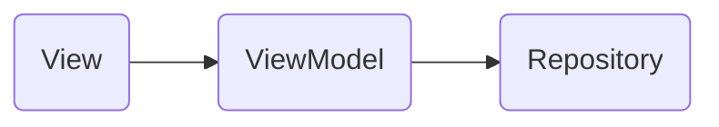
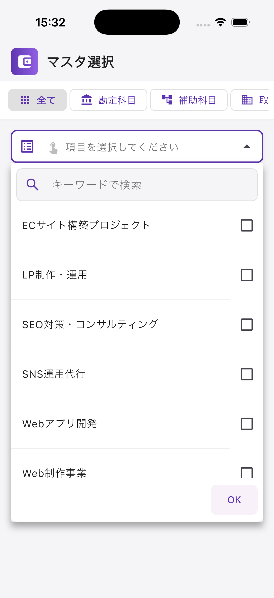
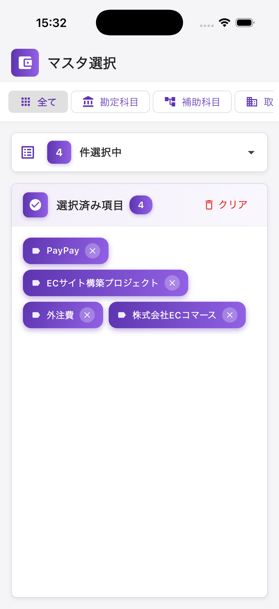
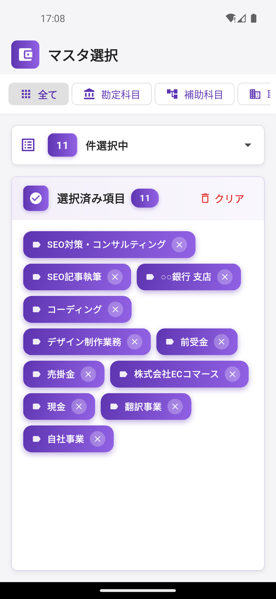

# New Searchable Combobox Example

## 📄 概要

Flutter ＆ Riverpod & UI実装パッケージを利用した複数選択肢を選択して対象をChipで表示するアプリサンプルになります。

### 1. 想定アーキテクチャ概要



### 2. 画面スクリーンショット

サンプル的には簿記の仕分けの様な感じで、項目を複数選択して絞り込み検索の前段階を行う想定のものになります。

__【iOS】__

 

__【Android】__

 

### 3.サンプル構築の際に利用したもの

__【サンプルで利用したパッケージ】__

- flutter_riverpod:
    - 状態管理
    - https://pub.dev/packages/flutter_riverpod
- dropdown_search:
    - 絞り込み検索にも対応したドロップダウン検索に必要なプラグイン
    - https://pub.dev/packages/dropdown_search
- buttons_tabbar:
    - トグルボタン形式のタブバー表示をするために必要なプラグイン
    - https://pub.dev/packages/buttons_tabbar
- shared_preferences:
    - 選択内容履歴を保存＆表示をするために必要なプラグイン
    - https://pub.dev/packages/shared_preferences

### 4.Riverpod3.x系への対応

主な変更点は下記の通りになります。

__【1. StateProvider → Notifier + NotifierProvider】__

```dart
// Before (Riverpod 2.x)
final selectedMasterTypeProvider = StateProvider<MasterType>((ref) {
  return MasterTypes.all;
});

// After (Riverpod 3.x)
class SelectedMasterTypeNotifier extends Notifier<MasterType> {
  @override
  MasterType build() => MasterTypes.all;
  
  void update(MasterType type) {
    state = type;
  }
}

final selectedMasterTypeProvider = NotifierProvider<SelectedMasterTypeNotifier, MasterType>(
  SelectedMasterTypeNotifier.new,
);
```

__【2. StateNotifierProvider → Notifier + NotifierProvider】__

```dart
// Before (Riverpod 2.x)
class SelectedItemsNotifier extends StateNotifier<List<MasterItem>> {
  SelectedItemsNotifier(this.repository) : super([]) { ... }
}

final selectedItemsProvider = StateNotifierProvider<SelectedItemsNotifier, List<MasterItem>>((ref) {
  final repository = ref.watch(masterRepositoryProvider);
  return SelectedItemsNotifier(repository);
});

// After (Riverpod 3.x)
class SelectedItemsNotifier extends Notifier<List<MasterItem>> {
  @override
  List<MasterItem> build() { ... }
  
  MasterRepository get repository => ref.read(masterRepositoryProvider);
}

final selectedItemsProvider = NotifierProvider<SelectedItemsNotifier, List<MasterItem>>(
  SelectedItemsNotifier.new,
);
```

__【3. 状態更新の呼び出し方】__

```dart
// Before (Riverpod 2.x)
ref.read(selectedMasterTypeProvider.notifier).state = MasterTypes.values[index];

// After (Riverpod 3.x)
ref.read(selectedMasterTypeProvider.notifier).update(MasterTypes.values[index]);
```

